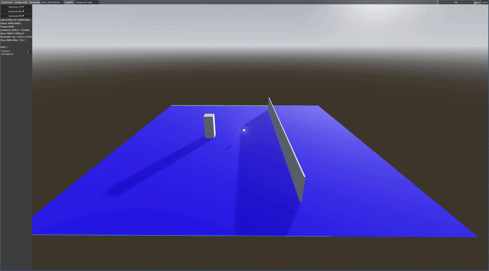

# SAARIS - Simulador Aberto de Antenas e RIS


**Título do Artigo:** SAARIS: Um Simulador Aberto de Antenas e Superfícies
Inteligentes Reconfiguráveis

**Resumo:**  A simulação de propagação de sinais em cenários urbanos densos é desafiadora. Este trabalho apresenta o SAARIS, um simulador interativo para planejamento de redes móveis com superfícies inteligentes reconfiguráveis (RIS). A ferramenta combina modelagem geométrica 3D do ambiente de simulação com modelos analíticos de propagação, permitindo a geração de mapas de calor e a manipulação direta de antenas e superfícies RIS. O SAARIS permite a importação de malhas urbanas do OpenStreetMaps, além de apresentar métricas quantitativas de cobertura. Os experimentos validam a ferramenta em comparação com modelos analíticos e demonstram a sua capacidade de mitigação de regiões de sombra com o posicionamento de uma superfície RIS.



Este artefato é uma ferramenta visual e interativa focada na simulação de propagação de sinais de radiofrequência, antenas e Superfícies Refletoras Inteligentes (RIS). O documento guia os avaliadores desde a configuração da engine gráfica até a operação da interface para reproduzir os mapas de calor e os cenários de teste estruturais.

# 1. Estrutura do readme.md

Este documento está organizado para guiar os avaliadores desde a configuração do ambiente até a replicação completa dos resultados do artigo. As seções incluem:

*   **1. Título e Resumo:** Apresenta o contexto do artefato.
*   **2. Selos Considerados e Preocupações com Segurança:** Informações importantes para o processo de avaliação.
*   **3. Requisitos, Dependências e Instalação:** Guias para preparar o ambiente de execução, incluindo opções para Docker.
*   **4. Experimentos:** Instruções detalhadas para reproduzir cada reivindicação do artigo, com opções de fluxo automatizado e manual.
*   **5. Controles Básicos:** Instruções gerais para o uso adequado da ferramenta
*   **6. LICENSE:** Informações sobre a licença do software.

# 2. Selos Considerados

Os selos considerados para este artefato são: **Disponível (SELOD)**, **Funcional (SELOF)**, **Sustentável (SELOS)** e **Reprodutível (SELOR)**.

*Preocupações com Segurança:* 
A execução deste simulador é segura. O software opera localmente realizando apenas cálculos físicos de propagação e renderização gráfica geométrica, sem acessar dados sensíveis ou rede externa.

# 3. Requisitos, Dependências e Instalação

Esta seção descreve os requisitos de hardware e software para a execução dos experimentos. Por se tratar de um ambiente gráfico interativo compilado, não há dependências de scripts externos ou bibliotecas complexas.

## 3.1 Informações Básicas

*   **Hardware:**
    *   Computador padrão com suporte a renderização 3D.
    *   Computador padrão com pelo menos **8 GB de RAM**.
    *   Aproximadamente **150 MB** de espaço livre em disco para o executável, assets geométricos e configurações.
*   **Software:**
    *   Sistema Operacional: Windows 10/11, macOS ou Linux.
    *   Opção Executável: Nenhuma engine necessária (Apenas Windows).
    *   Opção Código Fonte: Godot Engine 4.4.1 stable (Versão Standard).

## 3.2 Dependências
Os modelos 3D do cenário de teste inicial e o arquivo.osm da candelária ja estão incluidos no projeto, removendo qualquer necessidade de manipulação.

## 3.3 Instalação e Execução

Disponibilizamos duas formas de avaliar a ferramenta:

### Opção A: Binário Autossuficiente (Recomendado)
Está disponível um binário pré-compilado para Windows 10 x86_64.

1. Acesse a aba **Releases** deste repositório.
2. Baixe o arquivo .zip e extraia o seu conteúdo.
3. Execute o saaris.exe.

### Opção B: Via Código Fonte
Caso deseje avaliar o código fonte em macOS/Linux:

1. Baixe o Godot Engine 4.4.1
2. Clone este repositório
   ```bash
   git clone https://github.com/julioxcsf/saaris.git
3. Se baixou o ZIP, extraia-o. O GitHub cria uma pasta raiz (ex: saaris-main). Entre nela até localizar o arquivo project.godot.
4. Abra o Godot Engine 4.4.1.
5. Clique em "Import" no Gerenciador de Projetos.
6. Navegue e selecione a pasta interna que contém o arquivo project.godot.
7. Com o projeto aberto, pressione F5 para iniciar a simulação.

# 4. Experimentos

Este tópico orienta a reprodução das simulações do artigo.

## 4.1 Cenário de Teste Inicial

1. Inicie o simulador.
2. **Configure o transmissor:** Clique em **"Configurar TX"** e em seguida adicione um TX clicando em "+".
3. Execute a simulação.

### Reprodução dos Gráficos Analíticos
Os gráficos apresentados no artigo são dinâmicos e dependem dos dados espaciais gerados e exportados pelo simulador SAARIS para arquivos `.csv` (salvos automaticamente na pasta `Saves` do projeto após a conclusão de uma simulação).

### NOTA DE FIDELIDADE VISUAL
Para reproduzir exatamente o gradiente de cores das figuras do artigo, acesse Configurações → Mapa de Calor e defina os limites de potência conforme a escala de validação: Máxima (-40 dBm), Crítica (-75 dBm) e Mínima (-120 dBm).

Para validar a plotagem teórica vs. simulação numérica e garantir a reprodutibilidade (SELOR) sem a necessidade de instalar Python localmente, disponibilizamos um script em formato Jupyter Notebook (`Analise_Resultados_SAARIS.ipynb`) na raiz deste repositório.

**Fluxo de Validação:**
1. Execute o Experimento de Propagação Básica no simulador SAARIS. Ao final do processamento, o motor exportará um arquivo chamado `saaris_export_[DATA-HORA].csv` para a pasta `Saves`.
2. Acesse uma plataforma online como o **Google Colab** (colab.research.google.com) ou JupyterLite e faça o upload do arquivo `Analise_Resultados_SAARIS.ipynb`.
3. No painel de arquivos da plataforma online, faça o upload do `.csv` que o simulador gerou.
4. Execute as células do Notebook. O script identificará automaticamente o CSV gerado, aplicará o modelo teórico matemático (ITU-R P.526) e fará a plotagem do gráfico analítico idêntico ao apresentado no artigo.

**Resultado esperado:**
O cenário simulado reproduzirá exatamente a imagem de demonstração apresentada no início desta página, ilustrando a propagação básica de radiofrequência, a atenuação no espaço livre e a formação nítida de zonas de sombra (difração) nos obstáculos geométricos.

## 4.2 Cenário da Igreja da Candelária

1. Na interface principal, clique em **"Save/Load"** e selecione "Carregar Cena".
2. Carregue o arquivo de simulação **"Candelaria_RIS"**.
3. Para testar a potência no receptor com ou sem a interferência do painel RIS, acesse "Gerenciar RIS" e ative ou desative o componente. Verifique a leitura da potência diretamente ("Uso da ponteira de potência", Seção 5.2 deste documento) na região do RX.
4. Caso deseje renderizar todo o mapa de calor do zero, clique em "cancelar" e, em seguida, "simular".

### Parametros do Experimento da Candelária:
Teste da configurção de redes moveis 5G n78:
TX: 40 dBm, 3.5 GHz

**Resultado esperado:**
- A zona de sombra estrutural atrás do monumento onde está localizado o RX passa a receber sinal.
- Observa-se o ganho prático de potência (**dBm**) preenchendo a região de NLOS (Non-Line-of-Sight) por meio do redirecionamento gerado pelo RIS.

# 5. Controles Básicos

Para operar o simulador adequadamente, siga os fluxos de interface abaixo:

1. Ajustes do transmissor (TX)
2. Câmera
3. Controles e configurações Simulação
4. Importação do Open Street Map (OSM)
5. Ajustes de RIS e receptor (RX)

## 5.1 Ajustes do Transmissor (TX)

**Adicionar TX:**
- Clique em **"Configurar TX"** e depois em **"+"**.
- O TX surge na origem `(0, 30, 0)` com:
  - Frequência: **2400 MHz**
  - Potência: **40 dBm**
- Todos os transmissores são **omnidirecionais**.

**Mover TX:**
- Escolha um plano para fixar e clique na posição desejada no cenário.
- Ou altere diretamente os valores **X, Y e Z** na interface.

**Limites:**
- Potência: **1 dBm a 100 dBm**
- Frequência: **1 kHz a 1 THz**
- Posição espacial: **-10000 a 10000**


## 5.2 Câmera

- Pressione **Esc** para habilitar/desabilitar o controle da câmera.

**Rotação:**
- Arraste o mouse.

**Movimentação (WASD):**
- **W** → frente  
- **S** → trás  
- **A** → esquerda  
- **D** → direita  

**Uso da ponteira de potência:**
- Após ativar a ponteira na interface, aperte com o botão DIREITO do mouse no mapa

**Configuração:**
- Vá em **Configurações → Ajustes de Câmera**
- Ajuste:
  - Velocidade
  - Sensibilidade
  - FOV


## 5.3 Controles e Configurações de Simulação

**Controle de Fluxo:**
- Clique em **"Simular"** para gerar o mapa de calor.
- Use:
  - **Pause** → interrompe temporariamente
  - **Cancelar** → reinicia a simulação

**Mapa de Calor:**
- Em **Configurações**, ajuste:
  - Potência mínima
  - Potência crítica
  - Potência máxima

**Escala Visual:**
- Ative a barra de cores na interface.

**Física do Simulador:**
- Em **Configurações → Ajustes do Simulador**, configure:
  - Expoente de perda de caminho
  - Número máximo de reflexões
  - Perda por reflexão (dB)
  - Cores referentes a cada valor de potência


## 5.4 Importação de Cenários (OSM)

Para simular ambientes reais:

- Selecione a opção de importação de mapa.
- Carregue um arquivo `.osm`.

O sistema irá:
- Gerar malhas 3D (prédios e solo)
- Gerar malha de colisão


## 5.5 Superfícies Refletoras Inteligentes (RIS) e Receptores (RX)

**Configurar RX:**
- Defina a área de interesse no cenário.

**Adicionar RIS:**
- Vá em **"Gerenciar RIS"**
- Adicione uma nova superfície.

**Parâmetros do RIS:**
- Eficiência da placa
- Número de células (**N x M**)

**Alinhamento:**
- O motor calcula automaticamente a bissetriz geométrica entre TX e RX, otimizando ângulo de incidência


# 6. LICENSE

Este projeto está licenciado sob a Licença MIT. Consulte o arquivo `LICENSE` para obter mais detalhes.
