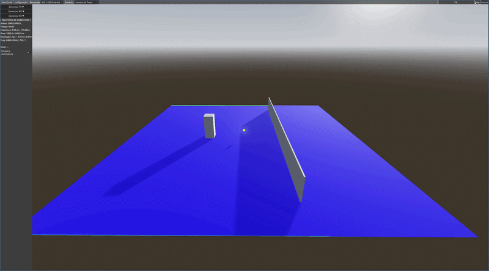

# SAARIS - Simulador Aberto de Antenas e RIS


**Artigo:** SAARIS: Um Simulador Aberto de Antenas e Superfícies Inteligentes Reconfiguráveis
(SBRC 2026, Salão de Ferramentas, **menção honrosa**) — [leia no SOL/SBC](https://sol.sbc.org.br/index.php/sbrc_estendido/article/view/42594)

**Resumo:** A simulação de propagação de sinais em cenários urbanos densos é desafiadora. O SAARIS é um simulador interativo para planejamento de redes móveis com superfícies inteligentes reconfiguráveis (RIS). A ferramenta combina modelagem geométrica 3D do ambiente com modelos analíticos de propagação, permitindo a geração de mapas de calor e a manipulação direta de antenas e superfícies RIS. Importa malhas urbanas do OpenStreetMap e apresenta métricas quantitativas de cobertura.



---

# 1. Qual versão baixar?

| Versão | Motor de cálculo | Para quem | Onde baixar |
|---|---|---|---|
| **v2.0 (GPU)** — atual | Compute shaders (GLSL) na GPU | Uso geral, cenários grandes, resoluções altas | **Releases → `v2.0-gpu`** (este código, branch `main`) |
| **v1.0 (CPU)** — original do artigo | Cálculo em CPU | Reproduzir exatamente os resultados do artigo, máquinas sem GPU adequada | **Releases → `v1.0-cpu`** (código: tag/branch `cpu-v1`) |

Se o objetivo é **reproduzir os gráficos do artigo**, use a **v1.0 (CPU)**: o roteiro de experimentos, o notebook `Analise_Resultados_SAARIS.ipynb` e os valores esperados descritos no artigo correspondem a ela.

---

# 2. Novidades da versão 2.0 (GPU)

* **Cálculo na GPU** (compute shaders GLSL), com despacho em faixas (*tiles*) para suportar resoluções de até 4096 × 4096 sem estourar o tempo limite do driver.
* **Propagação mais completa:** visada direta (log-distância com expoente `n` configurável), reflexões com perda fixa por salto, **penetração** em prédios e **difração** em gume de faca (baseada na ITU-R P.526) no topo e nas arestas verticais do prédio que bloqueia, encadeando até 3 prédios. As contribuições são somadas em Watts.
* **Parâmetros físicos ajustáveis** em *Configurações → Ajustes do Simulador*: expoente de perda, número máximo de reflexões e perda por reflexão (dB).
* **Relatório de cobertura** (HTML ou Markdown) — ver seção 3.
* **Ponteira de potência detalhada:** ao apontar um ponto do mapa, uma janela móvel e colorida mostra a distância (3D e horizontal), se há visada, e o detalhamento da perda (espaço livre, zona de Fresnel, transmissão pelo prédio e tabela de difração), comparando o cálculo analítico do ponto com o resultado da GPU.
* **Limpeza do código** e comentários padronizados.

## Desempenho: CPU × GPU

Cenário da Candelária, **5 medidas por resolução** (tempo médio ± desvio-padrão).

| Resolução | CPU (média) | CPU (desvio) | GPU (média) | GPU (desvio) | Aceleração |
|---|---|---|---|---|---|
| 128 × 128 | 16,4 s | 0,55 s | 0,038 s | 0,0034 s | ~430× |
| 256 × 256 | 67,8 s (1:08) | 0,84 s | 0,057 s | 0,0020 s | ~1.190× |
| 512 × 512 | 318,0 s (5:18) | 0,71 s | 0,106 s | 0,0038 s | ~3.000× |
| 1024 × 1024 | 2066,8 s (34:27) | 5,07 s | 0,273 s | 0,0239 s | ~7.570× |
| 2048 × 2048 | — | — | 0,733 s | 0,0869 s | — |
| 4096 × 4096 | — | — | 1,932 s | 0,0075 s | — |

> **Hardware de medição:** [PREENCHER: GPU, CPU e RAM usadas]

Na CPU, o tempo cresce mais que 4× a cada dobra de resolução, chegando a **34 min em 1024²**. Na GPU, a mesma resolução leva **0,27 s**, e 4096² (16× mais pixels) leva **1,9 s**, o que torna possível reposicionar antenas e RIS e simular de novo de forma praticamente interativa.

---

# 3. Relatório de cobertura

Ao final de uma simulação, o SAARIS gera um relatório em **HTML** ou **Markdown** (pasta `Saves/Relatorios`) para registrar a simulação e os principais dados:

* **TX, RX e RIS:** posições, frequência, potência e parâmetros.
* **Execução da simulação:** resolução, **GPU e CPU utilizadas**, número de despachos e **tempo de simulação**.
* **Área de cobertura:** percentual de pixels acima do limiar e dimensões do mapa.
* **Comparação da potência recebida no RX com e sem o efeito do RIS.**

---

# 4. Limitações da versão 2.0 e validação

* **A versão 2.0 não possui modelo analítico de comparação.** A validação contra modelos analíticos (ITU-R P.526) descrita no artigo foi feita com a versão 1.0 (CPU).
* **Medidas de campo estão sendo coletadas** para uma futura comparação entre simulador e experimento.
* O repositório contém código **experimental, desativado na interface**, para relevo e importação automática de dados geográficos (`Scripts/Geo/` e `Shaders/saaris_engine_v5_relevo.glsl`). Sem terreno, a v5 se comporta de forma idêntica à v4. O suporte a relevo é **trabalho futuro** e ainda não é uma funcionalidade suportada.
* Todos os transmissores são omnidirecionais; o mapa soma, em Watts, a contribuição de todas as antenas ligadas.

---

# 5. Instalação e execução

## 5.1 Requisitos

* **v2.0 (GPU):** Windows 10/11 e **placa de vídeo com suporte a Vulkan**; 8 GB de RAM; ~150 MB livres. Para código-fonte: Godot Engine 4.4.1 (Standard).
* **v1.0 (CPU):** qualquer computador com 8 GB de RAM; apenas muito mais lenta.

## 5.2 Opção A: executável (recomendado)

1. Abra a aba **Releases** deste repositório.
2. Baixe o `.zip` da versão desejada (**`v2.0-gpu`** ou **`v1.0-cpu`**) e extraia.
3. Execute o `.exe` (mantenha o arquivo `.pck` na mesma pasta, se houver).

## 5.3 Opção B: código-fonte (Windows, macOS, Linux)

1. Instale o Godot Engine 4.4.1.
2. Clone o repositório:
   ```bash
   git clone https://github.com/julioxcsf/SAARIS.git
   ```
   Para a versão CPU: `git checkout cpu-v1`.
3. No Godot, clique em **Import** e selecione o arquivo `project.godot`.
4. Pressione **F5**.

Os modelos do cenário de teste e o `.osm` da Candelária já estão incluídos no projeto.

---

# 6. Uso rápido

1. Abra o simulador e clique em **Save/Load → Carregar Cena → `Candelaria_RIS`** (TX 40 dBm, 3,5 GHz, 5G n78).
2. Escolha a **resolução** e clique em **Simular**. O relatório é gerado ao final.
3. Em **Gerenciar RIS**, ligue/desligue o painel para ver o efeito no RX.
4. Ative a **ponteira de potência** e clique com o botão **direito** no mapa para ver o detalhamento da perda no ponto.

> Os valores de potência da v2.0 **não são idênticos** aos do artigo, pois o modelo de propagação evoluiu (penetração, difração encadeada, parâmetros ajustáveis). Para reproduzir o artigo, use a v1.0.

---

# 7. Controles básicos

## 7.1 Transmissor (TX)
* **Configurar TX → "+"** cria um TX na origem `(0, 30, 0)` com 2400 MHz e 40 dBm. Todos são **omnidirecionais**.
* Mova escolhendo um plano e clicando no cenário, ou editando **X, Y, Z**.
* Limites: potência 1–100 dBm; frequência 1 kHz–1 THz; posição -10000 a 10000.

## 7.2 Câmera
* **Esc** liga/desliga o controle da câmera. Arraste o mouse para girar; **W A S D** para mover.
* **Configurações → Ajustes de Câmera:** velocidade, sensibilidade e FOV.

## 7.3 Simulação
* **Simular** gera o mapa de calor; **Pause** interrompe; **Cancelar** reinicia.
* **Configurações → Mapa de Calor:** potência mínima, crítica e máxima, e cores. Para a escala das figuras do artigo: máxima -40 dBm, crítica -75 dBm, mínima -120 dBm.
* **Configurações → Ajustes do Simulador:** expoente de perda, máximo de reflexões e perda por reflexão.

## 7.3 Importação de cenários (OSM)
Selecione a importação de mapa e carregue um arquivo `.osm`. O sistema gera as malhas 3D (prédios e solo) e a malha de colisão.

## 7.4 RIS e receptores (RX)
* **Configurar RX:** defina a área de interesse.
* **Gerenciar RIS → adicionar:** eficiência da placa e número de células (N × M). O motor calcula a bissetriz geométrica TX–RX para o alinhamento.

---

# 8. Estrutura do repositório

* **Scripts/**: lógica em GDScript.
    * `Simulator/`: núcleo do simulador (execução na GPU, modelo de RIS, análise de ponto).
    * `Report/`: gerador do relatório.
    * `UI/`: menus, ponteira de potência e interface.
    * `Nodes/`: TX, RX, RIS, câmera e importador OSM.
    * `Tools/`: utilidades (matemática de RF).
    * `Geo/`: **experimental**, relevo e dados geográficos (inativo).
* **Cenas/**: arquivos `.tscn` dos ambientes 3D, RIS e interface.
* **Materiais/**: cores e materiais do mapa de calor.
* **Shaders/**: GLSL dos motores de cálculo (`v1` a `v4` e `v5` experimental) e do mapa de calor.
* **Saves/** e **Assets_BKP_Saves/**: cenas pré-configuradas (Candelária).
* **assets/**: mídia da documentação e modelos 3D.
* **Analise_Resultados_SAARIS.ipynb**: notebook do artigo (versão 1.0, CPU).

---

# 9. Licença

Licença MIT. Consulte o arquivo `LICENSE`.
